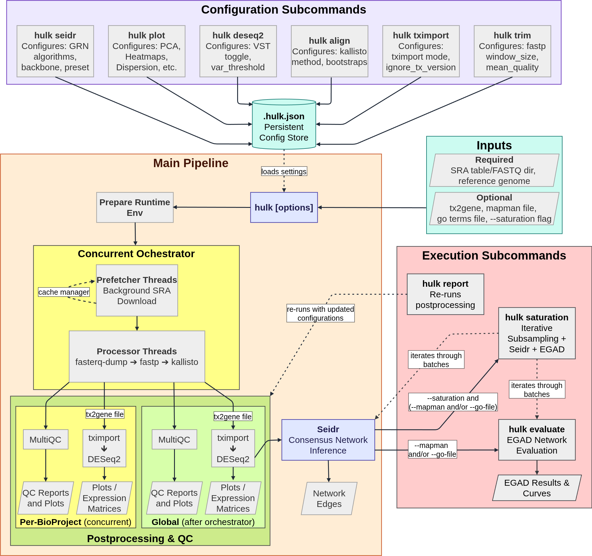

# **HULK** — High-Volume Bulk RNA-seq Pipeline

**HULK** is a fully automated, containerized pipeline for bulk RNA-seq. It takes data either from SRA accessions or from local FASTQ files and produces gene-level quantification, QC reports, R-based post-processing outputs (matrices and plots), and gene co-expression networks with a single command.

> Fetch / Import → QC/Trim → Quantify → Post-process → Network Inference (Seidr) → Evaluation (EGAD) → Report

<p align="center">
  
</p>
<p align="center">
  <em><b>Architecture and execution flow of the HULK pipeline.</b> The workflow is structured into three primary domains. Configuration Subcommands (top) modify the persistent <code>.hulk.json</code> store prior to data processing. The Main Pipeline (center) is initiated by the <code>hulk [options]</code> command, which ingests required inputs (sequencing data and a reference genome) and loads stored settings into a Concurrent Orchestrator for cache-regulated downloading and parallel read quantification. The progression of downstream modules is dictated by user-provided optional inputs. Supplying a <code>tx2gene</code> file triggers <code>tximport</code> followed by <code>DESeq2</code> within the Postprocessing & qc block to generate normalized expression matrices and plots across concurrent per-bp and post-orchestrator Global scopes. Global expression matrices subsequently feed into Seidr for consensus grn inference. From here, providing functional annotations (<code>--mapman</code> and/or <code>--go-file</code>) triggers the <code>hulk evaluate</code> module to assess network validity via EGAD, while the <code>--saturation</code> flag initiates network stability testing. Finally, Execution Subcommands (right) represent independent entry points, denoted by dashed arrows, allowing users to selectively trigger specific modules while bypassing upstream processing: <code>hulk report</code> re-runs postprocessing with updated configurations, and <code>hulk saturation</code> orchestrates an automated, iterative subsampling loop through the Seidr and EGAD modules.</em>
</p>

---

## Table of Contents

- [Features](#features)
- [Supported Platforms](#supported-platforms)
- [Installation](#installation)
- [Quickstart](#quickstart)
- [Input Table (SRA RunInfo)](#input-table-sra-runinfo)
- [FASTQ Mode](#fastq-mode)
- [Example Input Files](#example-input-files)
- [CLI Reference](#cli-reference)
- [Usage Examples](#usage-examples)
- [Output Structure](#output-structure)
- [Tools used inside HULK](#tools-used-inside-hulk)
- [License](#license)
- [Citation](#citation)
- [Links](#links)

## Features

- **End-to-end automation**
  - Fetches SRA runs (`prefetch`) **or** imports local FASTQ files (FASTQ mode).
  - Converts SRA accessions to FASTQ (`fasterq-dump`) in SRA mode.
  - Performs QC and trimming with `fastp`.
  - Quantifies transcript expression with `kallisto`.
  - Generates per-project and global `MultiQC` reports.

- **Two input modes**
  - **SRA mode**: runs are driven by an SRA RunInfo table with Run and BioProject information.
  - **FASTQ mode**: runs directly on user-provided FASTQ files grouped in a directory, sharing the same trimming, quantification and post-processing steps.

- **R-based post-processing**
  - Uses **tximport** to import quantification results into R.
  - Uses **DESeq2** (optional) to compute normalized gene-level count matrices and variance-stabilizing transform (VST) expression matrices.
  - Produces a comprehensive suite of QC plots (Variance Heatmaps, PCA, Sample-to-Sample Correlation, DESeq2 Dispersion).

- **Gene Co-expression Networks (GCN) & Evaluation**
  - Uses **Seidr** to automatically infer consensus gene networks directly from the DESeq2 VST matrices.
  - Evaluates network biological validity with **EGAD** (calculating Micro/Macro AUROC and AUPR) using MapMan or BioMart GO annotations.
  - Automated **Data Saturation Analysis** to assess network stability and reconstruction quality across iterative subsamples.

- **Containerized & reproducible**
  - Distributed as a Docker image.
  - No local installation of tools is required beyond Docker.
  - Designed to be resumable and safe to re-run in partially processed directories.

---

## Supported Platforms

| Vendor / Family        | Models                                                                      |
|------------------------|-------------------------------------------------------------------------|
| **Illumina NovaSeq** | 6000, X, X Plus                                                         |
| **Illumina HiSeq** | X Ten, 4000, 3000, 2500, 2000, 1500, 1000                               |
| **Illumina NextSeq** | 1000, 500, 550                                                          |
| **BGI / MGI** | DNBSEQ-G400, DNBSEQ-T7, BGISEQ-500, MGISEQ-2000RS                       |
| **Legacy Illumina** | Genome Analyzer II / IIX                                                |

---

## Requirements

- **OS:** Linux
- **Container:** Docker installed and usable
- **Network (for SRA mode):** To pull the image from Docker Hub and access NCBI/ENA.
- **Compute:** Designed for servers/HPC; large datasets and network inference can be highly computationally intensive.

---

## Installation

### Option 1 — Official installer (recommended)

```bash
curl -fsSL https://raw.githubusercontent.com/m13paiva/hulk/main/install_hulk.sh
```

This script pulls the latest Docker image `m13paiva/hulk:latest` and installs a wrapper at `/usr/local/bin/hulk`.

### Option 2 — Run via Docker (no install)

```bash
docker run --rm -v "$PWD":/data -w /data m13paiva/hulk:latest -i SraRunInfo.csv -r transcripts.fa.gz -o results
```

---

## Quickstart

### SRA mode (RunInfo table)

```bash
# Minimal run using a transcriptome FASTA
hulk -i RunInfo.csv -r transcripts.fa.gz -o results
```

### FASTQ mode (local FASTQ directory)

```bash
# Local FASTQ directory with one subdirectory per sample
hulk -i fastq_runs/ -r transcripts.fa.gz -o results_fastq --seq-tech "ILLUMINA NovaSeq 6000"
```

---

## Input Table (SRA RunInfo)

To generate an SRA RunInfo table from NCBI:
1. Go to the **SRA Search**: https://www.ncbi.nlm.nih.gov/sra
2. Search by **BioProject** or paste SRA accessions (e.g. `PRJNA1141930`).
3. Select your runs of interest.
4. Click **“Send to:” → “File” → “RunInfo”**.

---

## FASTQ Mode

In FASTQ mode, HULK skips SRA download and runs directly on local FASTQ files. You provide a **directory** via `-i / --input`. Each direct subdirectory is treated as one sample, and layout (SE vs PE) is inferred automatically. You must provide the `--seq-tech` argument.

---

## Example Input Files

To assist with formatting your data properly, examples of the required input files are provided. You can reference these to ensure your files are structured correctly before running the pipeline:

- **Input Dataset Table (`RunInfo.csv`)**: Example of the required CSV structure containing `Run`, `BioProject`, and `Model` columns for SRA mode.
- **MapMan Annotation File**: Example of the hierarchical functional annotation format used for EGAD network evaluation.
- **GO Term BioMart File**: Example of a TSV export from Ensembl BioMart mapping gene identifiers to Gene Ontology (GO) terms.

---

## CLI Reference

HULK uses a Click-based CLI with a main command and persistent configuration subcommands. Subcommand options are stored in `/app/.hulk.json`.

### Main command — `hulk [OPTIONS]`

```text
Required I/O
  -i, --input PATH          SRA mode: RunInfo table. FASTQ mode: directory. [required]
  -r, --reference PATH      Reference transcriptome or kallisto index. [required]

Outputs & performance
  -o, --output PATH         Output directory. [default: output]
  --min-threads INTEGER     Minimum number of threads per SRR/sample. [default: 4]
  -t, --max-threads INTEGER Maximum total threads. [default: 10]

Behaviour flags
  --verbosity               Enable live progress bars.
  -y, --yes                 Assume 'yes' to prompts.
  -f, --force               Force re-run: overwrite processed data.
  -n, --dry-run             Validate inputs and plan without running.
  --rem-missing-bps         DANGER: Remove output folders for BioProjects NOT present in the input table.

Quantification and post-processing
  -g, --gene-counts PATH    Enable gene-level counts using a tx2gene (.csv).
  --deseq2 / --no-deseq2    Enable DESeq2 normalization + VST expression matrices. [default: --deseq2]
  --seq-tech TEXT           Sequencing technology (Required in FASTQ mode).
  --target-genes PATH       File(s) containing target genes (one per line) for targeted heatmaps.
```

### Subcommand — `hulk trim`
Configure default `fastp` trimming parameters (`-ws` window size, `-mq` mean quality).

### Subcommand — `hulk tximport`
Configure how `tximport` aggregates and normalizes quantifications (`-m` mode, `--ignore-tx-version`).

### Subcommand — `hulk align`
Configure the alignment/quantification backend and its options (`--method`, `-b` bootstraps).

### Subcommand — `hulk plot`
Configure which plots are requested in post-processing (e.g., `--global-pca`, `--sample-cor`, `--dispersion`, `--top-n`).

### Subcommand — `hulk seidr`
Configure Seidr gene network inference defaults (`--preset`, `--algo`, `-b` backbone threshold, `-w` workers).

### Subcommand — `hulk evaluate`
Run EGAD evaluation on the main consensus network (`-m` MapMan, `-g` GO file, `--metrics`).

### Subcommand — `hulk saturation`
Run data saturation analysis: Subsampling → Seidr → EGAD (`-i` iterations, `-s` steps, `--plot-only`).

### Subcommand — `hulk report`
Regenerate plots and matrices using saved settings without re-running the entire pipeline.

---

## Usage Examples

```bash
# 1) Basic SRA-based run with a transcriptome FASTA
hulk -i RunInfo.csv -r transcripts.fa.gz -o results

# 2) Using a prebuilt kallisto index
hulk -i RunInfo.csv -r transcripts.idx -o results

# 3) Force re-run of everything (including post-processing)
hulk -i RunInfo.csv -r transcripts.fa.gz -o results -f

# 4) Generate gene counts (requires tx2gene mapping)
hulk -i RunInfo.csv -r transcripts.fa.gz -g tx2gene.csv -o results

# 5) Dry run (validate configuration without running tools)
hulk -i RunInfo.csv -r transcripts.fa.gz -o results -n --verbosity

# 6) Configure fastp defaults and then run
hulk trim -ws 30 -mq 20
hulk -i RunInfo.csv -r transcripts.fa.gz -o results

# 7) Configure tximport defaults and then run
hulk tximport -m raw_counts --ignore-tx-version
hulk -i RunInfo.csv -r transcripts.fa.gz -g tx2gene.csv -o results

# 8) Configure kallisto bootstraps
hulk align -b 250
hulk -i RunInfo.csv -r transcripts.fa.gz -o results

# 9) Configure advanced plotting behaviour (Saved persistently)
hulk plot --global-pca true --sample-cor true --dispersion true --top-n 1000
hulk -i RunInfo.csv -r transcripts.fa.gz -o results

# 10) Regenerate reports for an existing run (uses saved plot settings)
hulk report -o results -g tx2gene.csv --target-genes my_pathway.txt

# 11) Run via Docker directly (no wrapper install)
docker run --rm -v "$PWD":/data -w /data m13paiva/hulk:latest -i RunInfo.csv -r transcripts.fa.gz -o results --verbosity

# 12) FASTQ mode (local FASTQ directory)
# fastq_runs/ has one subdirectory per sample, each with 1 (SE) or 2 (PE) FASTQ/FASTQ.GZ files.
hulk -i fastq_runs/ -r transcripts.fa.gz -o results_fastq --seq-tech "ILLUMINA NovaSeq 6000" --verbosity

# 13) Run EGAD network evaluation with MapMan annotations
hulk evaluate -o results -m MapMan_annotations.txt --metrics both

# 14) Run data saturation analysis with 3 iterations across 10 steps
hulk saturation -o results -i 3 -s 10 --seidr-preset FAST -m MapMan_annotations.txt
```

---

## Output Structure

A typical output directory looks like this:

```text
outdir/
├── PRJNA1141930/
│   ├── SRR30141434/
│   │   ├── fastp.json              
│   │   ├── abundance.tsv           
│   │   └── SRR30141434.log         
│   ├── plots/                      
│   ├── deseq2/                     
│   └── PRJNA1141930.log            
└── shared/                         
    ├── plots/                      ← Global PCA, Heatmaps, Sample Cor, Dispersion
    ├── deseq2/                     ← Global DESeq2 counts & VST matrices
    ├── seidr/                      ← Consensus networks and backbone edge tables
    ├── egad/                       ← Network evaluation metrics and AUROC/AUPR curves
    ├── saturation/                 ← Data saturation curves and batch testing artifacts
    └── multiqc_global.html         
```

---

## Tools used inside HULK

If you use HULK in your research, please also consider citing the underlying tools where appropriate:

- **NCBI SRA Toolkit** (prefetch, fasterq-dump)
- **fastp** (read QC and trimming)
- **kallisto** (pseudoalignment)
- **MultiQC** (QC aggregation)
- **tximport & DESeq2** (normalization and VST)
- **Seidr** (Gene co-expression network inference)
- **EGAD** (Network biological evaluation)

---

## License
**MIT License** © 2026 Manuel Paiva de Almeida

---

## Citation
If you use HULK in your research, please cite the software as:
>Paiva de Almeida, M., & Barros, P. **HULK: High-volume bulk RNA-seq pipeline.** https://github.com/m13paiva/hulk

---

## Links

- GitHub: [https://github.com/m13paiva/hulk](https://github.com/m13paiva/hulk)
- Docker Hub: [https://hub.docker.com/r/m13paiva/hulk](https://hub.docker.com/r/m13paiva/hulk)
